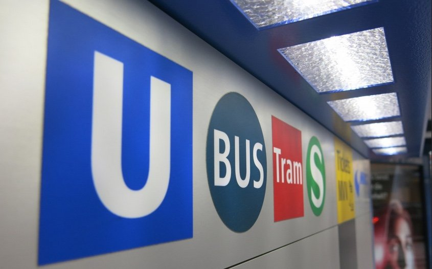

# Alexander Bergmann Projekt Tagebuch

## Woche 1 

20.04. - 26.04.2020

| Datum  | Tätigkeit                       | Dauer | Zusatz |
| ------ | ------------------------------- | ----- | ------ |
| 20.04. | Zoom-Meeting                    | 1,5 h |        |
| 21.04. | Gruppen-Meeting                 | 1,5 h |        |
| 23.04. | Literaturrecherche Ausarbeitung | 2 h   |        |
| 24.04. | Literaturrecherche Ausarbeitung | 1,5 h |        |
|        |                                 | 6,5 h |        |

## Woche 2 

27.04. - 03.05.2020

| Datum  | Tätigkeit                | Dauer | Zusatz                             |
| ------ | ------------------------ | ----- | ---------------------------------- |
| 27.04. | Repository konfiguration | 1 h   |                                    |
| 28.04. | Planung Microservice     | 2 h   | Use Case, User Stories             |
| 28.04. | Gruppen-Meeting          | 1,5 h |                                    |
| 30.04  | Go Lang Recherche        | 2 h   | Grundlagen Programmieren mit Go    |
| 30.04. | Go Docker Image erzeugen | 2 h   | Go in einem Docker image betreiben |
|        |                          | 8,5   |                                    |

## Woche 3

04.05. - 10.05.2020

| Datum  | Tätigkeit                                    | Dauer  | Zusatz                                                       |
| ------ | -------------------------------------------- | ------ | ------------------------------------------------------------ |
| 04.05. | Frontend Framework Vue.js Grundlagen         | 2 h    |                                                              |
| 04.05. | Präsentation                                 | 1,5 h  |                                                              |
| 05.05. | Literaturrecherche Ausarbeitung              | 2 h    |                                                              |
| 05.05. | Gruppen-Meeting                              | 1,5 h  |                                                              |
| 06.05. | Spezifikation bearbeiten                     | 2,5 h  | UseCases, User Stories, Beschreibung                         |
| 07.05. | Spezifikation bearbeiten                     | 1 h    | Schnittstellen, Rollen, Qualität, Meilensteine               |
| 07.05. | Präsentation                                 | 2 h    |                                                              |
| 07.05. | Spezifikation bearbeiten                     | 1,5 h  | Prototyp Datenmodell                                         |
| 07.05. | Spezifikation bearbeiten                     | 1,5 h  | Prototypen Mockups                                           |
| 08.05. | Go Lang Server mit gRPC                      | 5 h    | Erstellung einer Client/ Server Kommunikation mit Go über gRPC **(Failed)** |
| 09.05. | Daten in Postgresql DBMS schreiben (Go+gRPC) | 3 h    | **(Failed)** - gRPC nicht genau so verwendbar wie REST       |
| 09.05. | Vue.js Grundlagen und Beispiel Projekt       | 3 h    |                                                              |
| 10.05. | FE, BE und DB containerisiert betreiben      | 3 h    |                                                              |
|        |                                              | 29,5 h |                                                              |

## Woche 4

11.05. - 17.05.2020

| Datum  | Tätigkeit                       | Dauer | Zusatz |
| ------ | ------------------------------- | ----- | ------ |
| 11.05  | Präsentation                    | 1,5 h |        |
| 12.05. | Gruppen-Meeting                 | 1,5 h |        |
| 13.05. | Literaturrecherche Ausarbeitung | 1 h   |        |
| 14.05. | Literaturrecherche Ausarbeitung | 1,5 h |        |
| 15.05. | Literaturrecherche Ausarbeitung | 2 h   |        |
| 16.05. | Literaturrecherche Ausarbeitung | 1,5 h |        |
|        |                                 | 9 h   |        |

## Woche 5

18.05. - 24.05.2020

| Datum  | Tätigkeit                         | Dauer | Zusatz                  |
| ------ | --------------------------------- | ----- | ----------------------- |
| 18.05. | Präsentation                      | 1,5 h |                         |
| 19.05. | Frontend-Welcome-Screen umsetzung | 3 h   | Einarbeitung minicss    |
| 19.05. | Literaturrecherche Ausarbeitung   | 2 h   |                         |
| 19.05. | Infrastrukurplanung               | 1 h   | Erstellen der Übersicht |
| 19.05. | Gruppen-Meeting                   | 1,5 h |                         |
| 21.05. | Literaturrecherche Ausarbeitung   | 1,5 h |                         |
| 22.05. | Docker Support für Andre Matutat  | 1,5 h | Scala App dockerisieren |
| 22.05. | Login mit Firebase im Frontend    | 4 h   |                         |
| 23.05. | Infrastruktur+CI/CD Team Meeting  | 1,5 h |                         |
| 23.05. | Infrastruktur+CI/CD Team Meeting  | 1,5 h |                         |
|        |                                   | 19 h  |                         |

## Woche 6

25.05. - 31.05.2020

| Datum  | Tätigkeit                        | Dauer | Zusatz                                         |
| ------ | -------------------------------- | ----- | ---------------------------------------------- |
| 25.05. | Infrastruktur+CI/CD Team Meeting | 3 h   | Ein Micro Service Kubernetisiert (**success**) |
| 25.05. | Präsentation                     | 1,5 h |                                                |
| 26.05. | Gruppen-Meeting                  | 1 h   |                                                |
| 26.05. | Ausarbeitung v1                  | 3 h   | Gliederung Fertig und erste Inhalte            |
| 28.05. | Ausarbeitung Inhalt              | 4 h   |                                                |
| 29.05. | Ausarbeitung Inhalt              | 3 h   |                                                |
| 30.05. | Ausarbeitung Inhalt              | 2,5 h |                                                |
|        |                                  | 18 h  |                                                |

## Woche 7

01.06. - 07.06.2020

| Datum  | Tätigkeit                                  | Dauer | Zusatz                                 |
| ------ | ------------------------------------------ | ----- | -------------------------------------- |
| 01.06. | Ausarbeitung Präsentation                  | 3 h   |                                        |
| 02.06. | Infrastruktur+CI/CD Team Meeting           | 2,5 h |                                        |
| 02.06. | Gruppen-Meeting                            | 1 h   |                                        |
| 04.06. | Ausarbeitung Präsentation                  | 2 h   |                                        |
| 04.06. | Infrastruktur-Team Meeting                 | 2,5 h |                                        |
| 04.06. | Präsentation                               | 1,5 h |                                        |
| 05.06. | Infrastruktur-Team Meeting                 | 6 h   | Kubernetes MS Kommunikation            |
| 05.06. | Gruppen-Meeting                            | 0,5 h |                                        |
| 05.06. | Infrastruktur-Team Meeting                 | 2 h   | Kubernetes MS Kommunikation nach außen |
| 06.06. | Spezifikation, Mockups, Coding für Projekt | 2 h   |                                        |
| 07.06. | Ausarbeitung Präsentation                  | 6 h   |                                        |
|        |                                            | 29 h  |                                        |

## Woche 8

08.06. - 14.06.2020

| Datum  | Tätigkeit                                   | Dauer  | Zusatz                                                       |
| ------ | ------------------------------------------- | ------ | ------------------------------------------------------------ |
| 08.06. | Ausarbeitung Präsentation                   | 4 h    |                                                              |
| 08.06. | Präsentation und Smartcity Zwischenergebnis | 2 h    |                                                              |
| 09.06. | Infrastruktur-Team Meeting                  | 2 h    | Persistente Laufwerke für die Datenbank erstellen + Datenbank deployment |
| 09.06. | Gruppen-Meeting                             | 1 h    |                                                              |
| 09.06. | Microservice delpoyment + Datenbank + Test  | 2 h    |                                                              |
| 12.06. | Dev Umgebung MicroService anpassen          | 2,5 h  |                                                              |
|        |                                             | 13,5 h |                                                              |

## Woche 9

15.06. - 21.06.2020

| Datum  | Tätigkeit                                  | Dauer  | Zusatz                                     |
| ------ | ------------------------------------------ | ------ | ------------------------------------------ |
| 15.06. | Präsentation                               | 1,5 h  |                                            |
| 16.06. | Infrastruktur-Team Meeting                 | 2 h    | Smartcity per HTTPS erreichbar machen      |
| 16.06. | Gruppen-Meeting                            | 1,5 h  |                                            |
| 16.06. | Arbeit an MicroService                     | 2 h    |                                            |
| 17.06. | Versuch die gRPC-Verbindung zu realisieren | 5 h    | gRPC mit Go ist die HÖLLE!!!!!**(Failed)** |
| 18.06. | gRPC Verbindung fehler gefunden            | 3 h    |                                            |
| 18.06. | Presentation                               | 1,5 h  |                                            |
|        |                                            | 16,5 h |                                            |

## Woche 10

22.06. - 28.06.2020

| Datum           | Tätigkeit                     | Dauer | Zusatz                      |
| --------------- | ----------------------------- | ----- | --------------------------- |
| 23.06.          | Präsentation                  | 1,5 h |                             |
| 24.06.          | Gruppen-Meeting               | 1,5 h |                             |
| 25.06.          | Präsentation                  | 1,5 h |                             |
| 26.06. - 28.06. | Bug-Fixing, Logs auslese, ... | 3 h   |                             |
| 27.06.          | Arbeit am MS                  | 4,5 h | Reduzieren des Datenmodells |
| 28.06.          | Gruppen-Meeting               | 1 h   |                             |
|                 |                               | 13 h  |                             |

## Woche 11

29.06. - 05.07.2020

| Datum  | Tätigkeit       | Dauer | Zusatz                      |
| ------ | --------------- | ----- | --------------------------- |
| 29.06. | Arbeit am MS    | 5 h   | Optik und Usecase Umsetzung |
| 29.06. | Präsentation    | 1,5 h |                             |
| 30.06. | Arbeit am MS    | 5 h   |                             |
| 30.06. | Gruppen-Meeting | 1,5 h |                             |
| 01.07. | Arbeit am MS    | 6 h   |                             |
| 02.02  | Arbeit am MS    | 4 h   |                             |
| 02.07. | Projektabgabe   | 2 h   |                             |
|        |                 | 25 h  |                             |

__Gesamte Zeit ca 187,5 Stunden__

